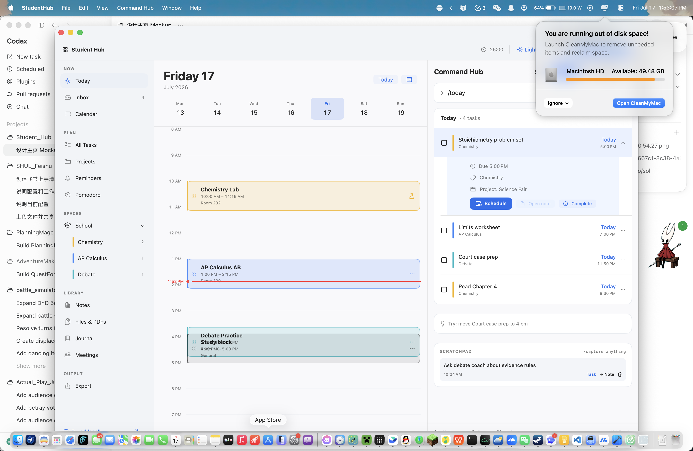
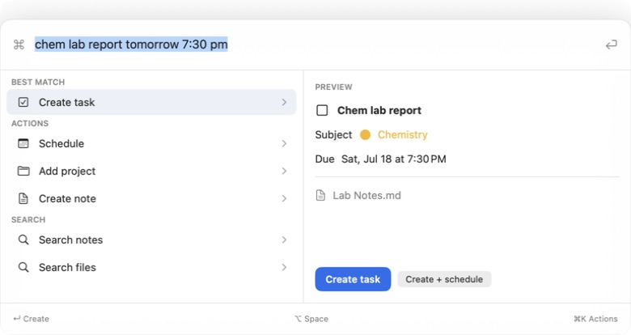

<p align="center">
  
</p>

# Student Hub

Student Hub is a lightweight, local-first study workspace for macOS, iPhone, and iPad. It brings tasks, schedules, projects, Markdown notes, files, journals, meetings, and focus timers into one connected SwiftUI app.



## Highlights

- **Quick Command:** press `Option-Space` on macOS, or tap the command button on iPhone/iPad, to capture, search, schedule, and run actions.
- **Natural dates:** understands input such as `Math homework tomorrow 8pm`, `next Tue`, `Jul 22`, `7月20日`, and `下周三下午4点`.
- **Focus commands:** use `start pomo`, `start 25 minute countdown`, or `start timer` for a Pomodoro, custom countdown, or count-up stopwatch.
- **Connected workspace:** tasks can link to calendar blocks, projects, notes, subtasks, meetings, and colored Spaces. Calendar blocks support exact typed times and 5-minute adjustments through midnight.
- **Obsidian-style Markdown:** notes render inside the editor; only the line being edited reveals its Markdown syntax. Select existing text to apply formatting, create Markdown tables, and export a note as PDF, Word/LibreOffice-compatible RTF, or Excel-compatible CSV.
- **Spaces:** create, rename, recolor, reorder, open, and directly delete Spaces together with their assigned content.
- **Files and PDFs:** import files, open them quickly, preview PDFs, and keep annotation notes/free-text PDF annotations.
- **Journal and meetings:** dated calendar entries, undated memos, transcripts, editable summaries, and action-item extraction.
- **Portable output:** share tasks/projects as CSV or Markdown and individual notes as PDF, RTF, or table CSV on every platform.
- **Native appearance:** responsive Mac/iPhone/iPad layouts with System, Light, and Dark modes.



## Requirements

- Xcode 26 or newer
- macOS 14 or newer
- iOS/iPadOS 17 or newer

No third-party runtime dependencies are required.

## Build from source

Open `StudentHub.xcodeproj`, select the `StudentHub` scheme, and run it on My Mac, an iPhone/iPad simulator, or a connected device.

For a real iPhone or iPad, open the StudentHub target's **Signing & Capabilities** tab and select your Apple Development team. Xcode can then create a personal provisioning profile for your device.

Command-line verification:

```sh
xcodebuild -project StudentHub.xcodeproj \
  -scheme StudentHub \
  -configuration Debug \
  -destination 'platform=macOS' \
  CODE_SIGNING_ALLOWED=NO test
```

## Data and privacy

Student Hub is local-first and has no analytics or advertising.

- Workspace database: `~/Library/Application Support/StudentHub/workspace.json`
- Markdown, imported files, and exports: `~/Documents/Student Hub Library/`
- Reset: use **Settings → Reset Student Hub** to return to a clean workspace.

Optional private CloudKit synchronization is implemented but disabled in the public build until a developer configures their own iCloud container and entitlements. See [SyncArchitecture.md](Docs/SyncArchitecture.md).

## macOS download

The GitHub Release includes a macOS app ZIP. It is ad-hoc signed, not Apple-notarized, so macOS may ask you to confirm it the first time. If needed, Control-click Student Hub and choose **Open**. Building from source is the most transparent installation path.

## Contributing

Issues and forks are welcome. Please keep changes focused, run the test command above, and verify affected iPhone/iPad layouts when changing shared SwiftUI views.

## License

Student Hub is available under the [MIT License](LICENSE).
